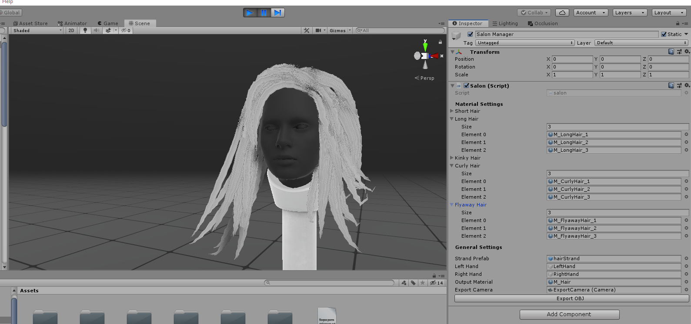
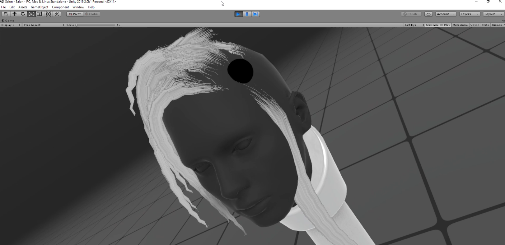
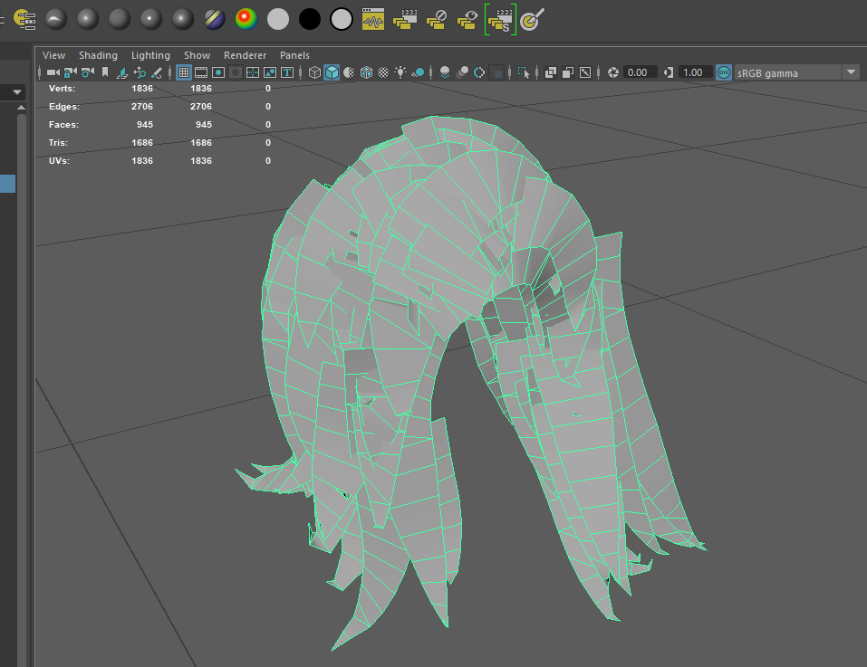

While it *is* getting better, authoring hair cards for real-time engines is still pretty painful. With hair polycount in some games like FFXV running up to *15 thousand polygons*, even the less painful card authoring systems like xgen are still pretty tedious - It's kind of a shame that after having a bunch of zBrush fibermesh fun character artists have to live off of splines and slow-paced iteration.

With this Unity project / Standalone tool authoring hair has never been easier - a little like Oculus' *Quill*, you simply point, drag and release to spawn strands of hair; you can then export the geometry to a third-party DCC for finetuning.

### Install process

Unlike most of my other stuff, this repo contains both a sample project and an executable release - It's up to you to decide if you want to do your grooming in-Unity (which can allow you to debug stuff you don't like or change materials) or use the more compact executable for portability (or if you use Godot or Unreal and don't have a Unity install on hand).

### Control Scheme

Just launch the standalone app or the *Salon* Unity scene inside the project.

- Motion Controller Trigger: Press and hold to draw hair.
- Keyboard Backspace *or* Motion Controller Grip Button: Undo.
- Spacebar: Export to OBJ. 

### Requirements
- Unity 2019.2.0b1 or later
- A VR headset with motion controllers (Tested on Oculus Rift CV1, ought to work with the HTC Vive + Wands and maybe with WMR headsets)

### TODO
- Make the multiple hair types backend actually work - a bunch of textures are in but it needs a bit of code.
- Better in-headset UI and UX
- Reference frame to load portraits

### Acknowledgements
[Hrafnkell Freyr Hlöðversson](https://wiki.unity3d.com/index.php/ObjExporter) for coming up with the OBJExporter script so I wouldn't have to.
[Matt Dean, Adam Frisby and Alan Zucconi](https://github.com/AdamFrisby/UnityHairShader) for the packaged Hair shader (full MIT license in the package). 

