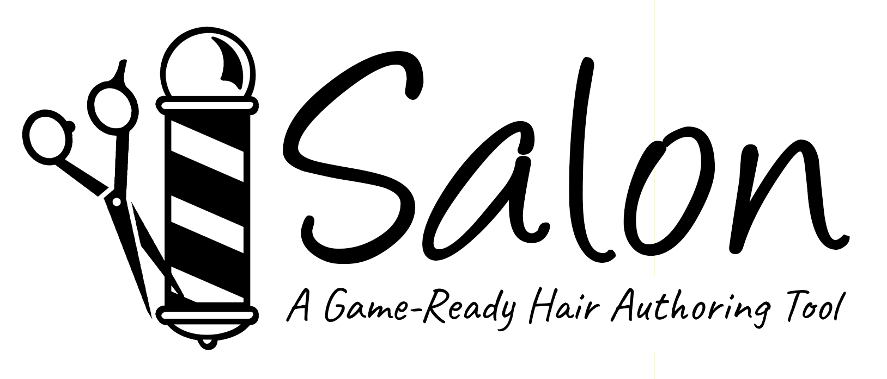

While it *is* getting better, authoring hair cards for real-time engines is still pretty painful. With hair polycount in some games like FFXV running up to *15 thousand polygons*, even the less painful card authoring systems like xgen are still pretty tedious - It's kind of a shame that after having a bunch of zBrush fibermesh fun character artists have to live off of splines and slow-paced iteration.

With this VR or not-VR tool, authoring hair has never been easier - a little like Oculus' *Quill* or a little like zbrush, you simply point, drag and release to spawn strands of hair; you can then export the geometry to a third-party DCC for finetuning.

### Install process

Unlike most of my other stuff, this repo contains both the source project and executable release - It's up to you to decide if you want to do your grooming in-Unity (which can allow you to debug stuff you don't like or change materials) or use the more compact executable for portability (or if you use Godot or Unreal and don't have a Unity install on hand).

### Control Scheme - Desktop

Just launch the standalone release or the *Salon2D* Unity scene inside the project.

- Left-click: Press and hold to draw hair.
- Right-click-and-Drag: Orbit Camera.
- Middle-click-and-Drag: Zoom Camera in and out.
- Q or Onscreen Button: Undo.
- Spacebar: Export to OBJ. 
- Onscreen buttons: Various functions like changing hair types.

### Control Scheme - VR

Just launch the standalone release or the *Salon* Unity scene inside the project.

- Motion Controller Trigger: Press and hold to draw hair.
- Backspace *or* Motion Controller Grip Button: Undo.
- Spacebar: Export to OBJ. 
- Escape: Quit

### Requirements
- Drawing tablet reccomended if you're using the 2D version
- Unity 2019.2.0b1 or later (if you're using the project and not the standalone build)
- A VR headset with motion controllers if you're using the VR version (Tested on Oculus Rift CV1, ought to work with the HTC Vive + Wands and maybe with WMR headsets)

### TODO
- Fix the bug where if you draw with both hands in VR it explodes
- Add multiple hair types to the VR mode - and make sure the material assignments export properly
- Better UV scaling to randomly pack hair in four UV quadrants
- Better in-VR-headset UX
- Reference frame to load portraits

### Acknowledgements & Thanks
- [Hrafnkell Freyr Hlöðversson](https://wiki.unity3d.com/index.php/ObjExporter) for coming up with the OBJExporter script so I wouldn't have to.
- [Matt Dean, Adam Frisby and Alan Zucconi](https://github.com/AdamFrisby/UnityHairShader) for the packaged Hair shader (full MIT license in the package). 

Per usual, whipped up in a few hours - Try and enjoy in spite of the bugs.

